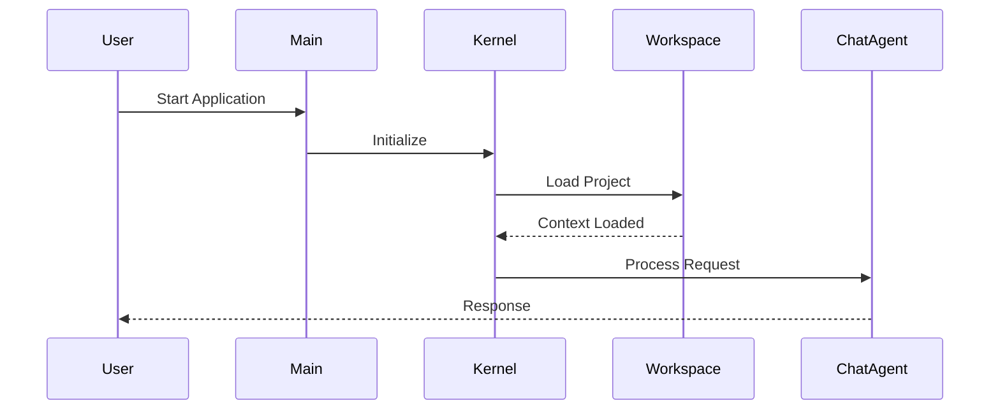

# SEOS User Guide

## Software Engineering Operating System

> **Official User Guide**
>
> **Version 3.0.0**

---

# Table of Contents

- Welcome
- What is SEOS?
- Why SEOS?
- The Paradigm Shift
- Before You Begin
- Installation
- Starting SEOS
- Understanding the Interface
- Command Reference
- Practical Examples
- Power User Recipes
- Tips & Best Practices
- Troubleshooting
- Frequently Asked Questions

---

# Welcome

Welcome to **SEOS**.

Whether you're a software engineer, student, architect, DevOps engineer or simply curious about AI-assisted software development, SEOS has been designed to become your daily engineering companion.

Unlike traditional AI chat applications, SEOS understands projects, source code, documents and engineering workflows.

Its objective is simple:

> Help you build software faster while keeping you in complete control.

---

# What is SEOS?

**SEOS (Software Engineering Operating System)** is a Local-First AI platform that assists software engineers during the complete software development lifecycle.

SEOS can:

- Understand existing projects
- Analyze source code
- Review code quality
- Detect bugs
- Generate new code
- Refactor existing code
- Translate documents
- Generate documentation
- Create diagrams
- Generate unit tests
- Coordinate autonomous engineering workflows

Unlike a generic chatbot, SEOS works directly with your project.

---

# Why SEOS?

Most AI assistants answer questions.

SEOS executes engineering tasks.

Instead of asking:

> Write me a Python class.

You can ask:

> Review my project.

or

> Generate unit tests.

or

> Translate my documentation.

or

> Analyze the impact of modifying this module.

SEOS understands the engineering context and executes the requested workflow.

---

# The Paradigm Shift (v3.0)

Beginning with version **3.0**, SEOS changed the way AI interacts with software projects.

Previous AI assistants typically generate code on screen and expect developers to manually copy and paste it.

SEOS works differently.

When appropriate, SEOS writes engineering artifacts directly into your project.

Instead of:

```text
AI
↓

Print code

↓

Developer copies

↓

Developer pastes

↓

Developer saves
```

SEOS performs:

```text
User Request

↓

SEOS analyzes

↓

SEOS generates

↓

SEOS validates

↓

SEOS writes files

↓

Done
```

The result is a significantly faster engineering workflow.

---

# Before You Begin

Before running SEOS, verify the following requirements.

## Python

Python 3.10 or newer.

---

## Local LLM (Recommended)

SEOS works best with a local Large Language Model.

Recommended providers:

- LM Studio
- Ollama

Cloud providers are also supported.

---

## Supported Operating Systems

- Windows
- Linux
- macOS

---

# Installation

Clone the repository.

```bash
git clone https://github.com/your-org/seos.git

cd seos
```

---

Create a virtual environment.

### Windows

```bash
python -m venv .venv

.venv\Scripts\activate
```

### Linux / macOS

```bash
python3 -m venv .venv

source .venv/bin/activate
```

---

Install SEOS.

```bash
pip install -e .
```

---

Configure your environment.

Copy:

```text
.env.example
```

to

```text
.env
```

Configure:

- LLM_PROVIDER
- API Keys (if applicable)
- SEOS_API_KEY

---

# Starting SEOS

First, start your preferred LLM provider.

Examples:

- LM Studio
- Ollama

Once the model is ready, launch SEOS.

```bash
seos
```

To start the REST server:

```bash
seos --headless
```

---

# Understanding the Interface

After startup, you'll see the SEOS banner followed by the command prompt.

```text
>
```

Every command begins with a slash.

Examples:

```text
/help
```

```text
/chat Explain this project
```

```text
/review src/main.py
```

```text
/translate docs/ es
```

---

# Command Categories

Commands are organized into several functional groups.

| Category | Purpose |
|----------|---------|
| System | General application commands |
| Chat & Memory | AI interaction |
| Knowledge | Roles and capabilities |
| Workspace | Project navigation |
| Software Factory | Code generation |
| Analysis | Code review and refactoring |
| Project Intelligence | Dependency analysis |
| Documents | Translation and OCR |
| Enterprise | Multi-agent workflows and integrations |

---

# 1. System Commands

## /help

Display all available commands.

```text
/help
```

---

## /help \<command>

Display detailed help for a specific command.

Example:

```text
/help review
```

---

## /info

Displays information about the current workspace.

---

## /exit

Safely closes SEOS.

Alternative commands:

```text
/quit
```

```text
/bye
```

---

## /tree [folder]

Display the current project tree.

Example:

```text
/tree

/tree src/
```

---

## /ls [folder]

List files contained in a directory.

---

## /mkdir \<folder>

Create a new directory.

Example:

```text
/mkdir services
```

---

## /projects

Display all projects currently loaded during the session.

---

## /switch \<project>

Switch between projects without restarting SEOS.

Example:

```text
/switch CRM
```

---

## /reindex

Force a rebuild of the Vector Database.

Useful after modifying files outside SEOS.

---

# 2. Chat & Memory

The Chat Engine is the primary interface between you and SEOS.

Unlike a traditional chatbot, SEOS understands your workspace and can execute engineering tasks.

---

## /chat \<message>

Send a request to SEOS.

```text
/chat Explain the authentication module
```

You can ask SEOS to:

- Explain source code
- Analyze architectures
- Generate code
- Review implementations
- Answer engineering questions
- Produce documentation

Examples:

```text
/ chat Explain core/kernel.py
```

```text
/chat Create a REST API for managing customers
```

```text
/chat Review this project's architecture
```

> **Note**
>
> If your request generates engineering artifacts, SEOS may automatically write the corresponding files into your project.

---

## /load \<file>

Loads a large prompt from a text file.

Useful when the prompt is too large to paste into the terminal.

Example:

```text
/load prompt.txt
```

---

## /write [path/file.ext]

Extracts the latest generated code and writes it to disk.

Example:

```text
/write src/models/customer.py
```

---

## /save \<file>

Saves the last AI response into a text file.

Example:

```text
/save architecture_notes.txt
```

---

# 3. Knowledge & Roles

SEOS can assume specialized engineering roles.

Changing the active role modifies how the AI approaches problems.

---

## /role \<name>

Activate a professional role.

Example:

```text
/role software_architect
```

Other possible roles include:

- software_architect
- senior_developer
- tech_lead
- security_engineer
- database_architect
- devops_engineer

---

## /role clear

Returns SEOS to its default conversational mode.

```text
/role clear
```

---

## /list \<roles|rules|capabilities> [area]

Displays the knowledge currently loaded inside SEOS.

Examples:

```text
/list roles
```

```text
/list capabilities
```

```text
/list capabilities AI
```

---

# 4. Workspace Management

SEOS works directly on your software projects.

Always open SEOS from the project's root directory whenever possible.

---

## Project Navigation

Display the project structure.

```text
/tree
```

Display a specific folder.

```text
/tree src/
```

Search files.

```text
/find kernel
```

List folder contents.

```text
/ls docs/
```

Create folders.

```text
/mkdir documentation
```

---

# 5. Software Factory

The Software Factory automates repetitive engineering tasks.

---

## /create

Generate project artifacts.

Syntax:

```text
/create <type> <name>
```

Example:

```text
/create class User
```

Example using folders:

```text
/create class services/auth_service
```

---

Supported artifact types depend on the installed capabilities.

Typical examples include:

- class
- module
- package
- service
- interface

---

## /create_api

Generate a FastAPI endpoint.

Example:

```text
/create_api endpoint to manage customers
```

---

## /create_db

Generate SQLAlchemy database models.

Example:

```text
/create_db Customer and Order models
```

---

## /create_docker

Generate a production-ready Dockerfile.

Example:

```text
/create_docker main.py
```

---

## /create_diagram

Generate a Mermaid diagram.

Example:

```text
/create_diagram user login flow
```

---

## /create_example

Generate a complete example demonstrating a concept.

Example:

```text
/create_example asyncio
```

---

## /migrate

Translate source code between programming languages.

Syntax:

```text
/migrate <file> <language>
```

Example:

```text
/migrate legacy_login.pl python
```

SEOS validates the generated code before saving whenever possible.

---

# 6. Code Analysis & Modification

These commands help improve existing software.

---

## /symbols

Display symbols discovered in a source file.

Example:

```text
/symbols src/main.py
```

Typical output includes:

- Classes
- Methods
- Functions

Supported languages include:

- Python
- Java
- JavaScript
- C#
- Rust
- Perl

---

## /review

Perform a software engineering review.

Example:

```text
/review core/kernel.py
```

The review may identify:

- Bugs
- Security vulnerabilities
- Code smells
- Performance issues
- Maintainability concerns
- Best-practice violations

---

## /refactor

Safely modify existing code.

Syntax:

```text
/refactor <file> <instruction>
```

Example:

```text
/refactor core/kernel.py extract banner logic into a separate function
```

For Python projects, SEOS validates the generated AST before applying changes whenever possible.

---

## /gentest

Generate unit tests.

Example:

```text
/gentest services/auth.py
```

Generated tests follow the project's existing testing conventions whenever they can be inferred.

---

# 7. Project Intelligence

One of SEOS's most powerful capabilities is understanding how your project is connected internally.

Instead of analyzing files individually, SEOS can reason about dependencies, relationships, and execution flow across the entire codebase.

---

## /impact

Analyze the impact of modifying a file.

Syntax:

```text
/impact <file>
```

Example:

```text
/impact core/kernel.py
```

SEOS analyzes:

- Files importing the target file
- Internal dependencies
- Potential side effects
- Modules that may require testing

> **Tip**
>
> Run this command before refactoring critical modules.

---

## /deadcode

Detect orphaned or unused code.

```text
/deadcode
```

SEOS searches for:

- Unused files
- Unused classes
- Unused functions
- Unreferenced modules

Cleaning dead code helps reduce technical debt and improves maintainability.

---

## /sequence

Generate a Mermaid sequence diagram.

Syntax:

```text
/sequence <file>
```

Example:

```text
/sequence main.py
```

The generated diagram illustrates:

- Execution flow
- Method calls
- Module interactions
- Dependency sequence

Example output:



---

# 8. Document Engine

The Document Engine provides AI-powered processing for technical documentation while preserving formatting whenever possible.

Most commands accept either:

- A single file
- An entire directory

---

## Supported Formats

SEOS can process:

| Format | Supported |
|---------|:---------:|
| TXT | ✅ |
| Markdown (.md) | ✅ |
| PDF | ✅ |
| DOCX | ✅ |
| XLSX | ✅ |
| PPTX | ✅ |

---

## /translate

Translate documents while preserving formatting.

Syntax:

```text
/translate <file|folder> <language>
```

Examples:

```text
/translate README.md es
```

```text
/translate docs/ en
```

Formatting preserved whenever possible:

- Headings
- Tables
- Images
- Lists
- Styles
- Hyperlinks

---

## /summarize

Generate a concise summary.

Syntax:

```text
/summarize <file|folder>
```

Example:

```text
/summarize architecture.pdf
```

Useful for:

- Technical specifications
- User manuals
- Design documents
- Research papers

---

## /rewrite

Improve readability and grammar.

Syntax:

```text
/rewrite <file|folder>
```

Example:

```text
/rewrite USER_GUIDE.md
```

Typical improvements include:

- Grammar
- Style
- Clarity
- Consistency

---

## /ocr

Extract text from images.

Syntax:

```text
/ocr <image>
```

Example:

```text
/ocr architecture.png
```

OCR is especially useful for:

- Scanned documents
- Screenshots
- Diagrams
- Printed manuals

---

# 9. Enterprise Features & Integrations

SEOS includes tools designed for professional software engineering teams.

---

## /sprint

Launch a complete autonomous software development workflow.

Syntax:

```text
/sprint <requirement>
```

Example:

```text
/sprint Create a JWT authentication module
```

A typical sprint consists of:

```text
Requirement

        │

        ▼

Architecture Planning

        │

        ▼

Code Generation

        │

        ▼

Testing

        │

        ▼

Documentation

        │

        ▼

Delivery
```

The participating agents may include:

- Architect
- Developer
- Reviewer
- Tester
- Documentation Agent

---

## /git

Execute Git commands without leaving SEOS.

Syntax:

```text
/git <command>
```

Examples:

```text
/git status
```

```text
/git add .
```

```text
/git commit "feat: add authentication"
```

---

## /github

Interact with GitHub through its API.

Syntax:

```text
/github <issue|pr> <owner/repository> <title>
```

Example:

```text
/github issue my-org/seos "Fix startup banner"
```

Supported operations include:

- Creating Issues
- Creating Pull Requests

---

## /serve

Start the integrated REST API server.

```text
/serve
```

Default port:

```text
8080
```

This mode is intended for:

- VS Code Extension
- External tools
- Remote automation

---

## /mcp

Interact with external MCP (Model Context Protocol) servers.

Syntax:

```text
/mcp <list|call> <server> [tool] [arguments]
```

Examples:

```text
/mcp list local-server
```

```text
/mcp call local-server search_code
```

---

## /metrics

Display usage statistics.

```text
/metrics
```

Typical information includes:

- LLM requests
- Prompt tokens
- Completion tokens
- Files created
- Session duration

---

## /audit

Display the immutable activity log.

```text
/audit
```

Useful for tracking:

- Generated files
- Modified files
- Recent engineering actions

---

## /adr

Generate an Architecture Decision Record.

```text
/adr
```

SEOS analyzes recent project activity and creates an ADR document summarizing architectural decisions.

---

## /install

Install community plugins directly from Git repositories.

Syntax:

```text
/install <github_url>
```

Example:

```text
/install https://github.com/example/seos-plugin
```

Installed plugins become immediately available without restarting SEOS.

---

# Practical Examples

The following examples demonstrate how SEOS can be used during a typical software development workflow.

---

# Example 1 — Understanding an Existing Project

Imagine you've just cloned a repository and know nothing about its architecture.

Start by asking SEOS to explain the project.

```text
/chat Explain this project
```

You can then inspect the project structure.

```text
/tree
```

Review a specific module.

```text
/chat Explain core/kernel.py
```

Or inspect the symbols defined in a file.

```text
/symbols core/kernel.py
```

---

# Example 2 — Creating a New Module

Suppose you need a new authentication service.

Instead of manually creating files, simply ask SEOS.

```text
/create class services/auth_service
```

SEOS generates the file directly inside your project.

You can immediately inspect it.

```text
/review services/auth_service.py
```

Then generate unit tests.

```text
/gentest services/auth_service.py
```

---

# Example 3 — Reviewing Existing Code

Review a source file.

```text
/review src/api/users.py
```

SEOS analyzes:

- Bugs
- Code smells
- Security issues
- Maintainability
- Best practices

If improvements are needed:

```text
/refactor src/api/users.py improve readability and add type hints
```

---

# Example 4 — Understanding Dependencies

Before modifying a core module, analyze its impact.

```text
/impact core/kernel.py
```

SEOS identifies every module depending on it.

Once the changes are complete, search for unused code.

```text
/deadcode
```

---

# Example 5 — Generating Documentation

Translate an entire documentation folder.

```text
/translate docs/ es
```

Improve the wording.

```text
/rewrite docs/
```

Generate summaries.

```text
/summarize docs/
```

---

# Example 6 — Modernizing Legacy Code

Analyze a legacy source file.

```text
/chat Explain legacy_login.pl
```

Migrate it.

```text
/migrate legacy_login.pl python
```

Review the migrated code.

```text
/review legacy_login.py
```

Generate tests.

```text
/gentest legacy_login.py
```

---

# Example 7 — Autonomous Development

Create an entire feature.

```text
/sprint Create a Customer Management REST API
```

SEOS coordinates the complete workflow.

Typical execution:

```text
Requirement

↓

Architecture

↓

Implementation

↓

Testing

↓

Documentation

↓

Delivery
```

Review the generated project.

```text
/tree
```

Inspect the architecture.

```text
/chat Explain the generated architecture
```

Generate a sequence diagram.

```text
/sequence main.py
```

---

# Power User Recipes

These workflows combine multiple commands to automate common engineering tasks.

---

## Recipe 1 — Learn an Unknown Project

```text
/tree

/chat Explain this project

/chat Explain the architecture

/symbols src/main.py

/review src/main.py
```

---

## Recipe 2 — Build a New Feature

```text
/create class models/customer

/create_api Customer CRUD

/create_db Customer table

/gentest models/customer.py

/review models/customer.py
```

---

## Recipe 3 — Safe Refactoring

```text
/impact services/auth.py

/refactor services/auth.py extract validation logic

/gentest services/auth.py

/deadcode

/git commit "refactor: extract validation logic"
```

---

## Recipe 4 — Documentation Workflow

```text
/translate docs/ es

/rewrite docs/

/summarize docs/

/save documentation_summary.md
```

---

## Recipe 5 — Complete Sprint

```text
/sprint Create an authentication module

/tree

/review src/

/sequence main.py

/adr

/git status
```

---

# Tips & Best Practices

## Start Your LLM First

Always verify that your preferred provider (LM Studio, Ollama, or a cloud provider) is available before starting SEOS.

---

## Open SEOS from the Project Root

Running SEOS from the project's root directory allows it to understand the complete workspace.

Recommended:

```text
my_project/

├── src/

├── docs/

├── tests/

└── ...
```

Then execute:

```bash
seos
```

---

## Review Before Refactoring

Before modifying important modules:

```text
/impact filename.py
```

After the refactor:

```text
/gentest filename.py
```

---

## Keep Documentation Updated

After implementing new features, consider:

```text
/rewrite README.md
```

or

```text
/summarize docs/
```

---

## Use Roles

Different engineering tasks benefit from different perspectives.

Example:

```text
/role software_architect
```

Later:

```text
/role clear
```

---

## Reindex After External Changes

If files are modified outside SEOS:

```text
/reindex
```

This refreshes the semantic index.

---

## Use Autonomous Sprints for Large Features

Instead of generating files individually:

```text
/sprint Implement user authentication with JWT
```

SEOS coordinates the complete workflow.

---

# Troubleshooting

## SEOS Cannot Connect to the LLM

Possible causes:

- LM Studio is not running.
- Ollama is not running.
- Incorrect provider configuration.
- Invalid API credentials.

Verify your `.env` configuration and ensure the provider is available.

---

## Commands Cannot Find Files

Possible causes:

- SEOS was started from the wrong directory.
- Incorrect relative path.
- File does not exist.

Verify the current workspace.

```text
/info
```

Inspect the directory tree.

```text
/tree
```

---

## AI Does Not Remember Recent Files

Refresh the semantic index.

```text
/reindex
```

---

## Generated Code Is Not Written to Disk

If automatic extraction cannot determine the destination, manually save the last generated code.

```text
/ write src/example.py
```

---

## Translation Preserves Only Part of the Formatting

Some document formats have limitations imposed by their internal structure.

Whenever possible, SEOS preserves:

- Styles
- Tables
- Images
- Headings
- Lists

---

# Frequently Asked Questions

## Does SEOS require an Internet connection?

No.

SEOS can operate entirely offline when using a local LLM provider such as LM Studio or Ollama.

---

## Does my source code leave my computer?

Not when using local providers.

If you use a cloud provider, only the information required to process your request is sent according to that provider's configuration.

---

## Can I use SEOS with existing projects?

Yes.

SEOS is designed to analyze and work with existing codebases as well as new projects.

---

## Can SEOS modify existing files?

Yes.

Certain commands are designed to safely modify existing files.

Always review changes before committing them to version control.

---

## Which programming languages are supported?

Current language support includes:

- Python
- Java
- JavaScript
- C#
- Rust
- Perl

Support will continue expanding in future releases.

---

# Next Steps

Now that you're familiar with SEOS, you may want to explore:

- **Developer Guide** — Learn how to build custom Agents, Skills, and Providers.
- **Architecture Guide** — Understand SEOS internals and system design.
- **API Reference** — Integrate SEOS into your own tools and workflows.
- **Plugin Development Guide** — Create and distribute custom plugins.

---

# Need Help?

If you're unsure how to accomplish a task, remember that you can always ask SEOS directly.

```text
/chat How should I implement authentication?

/chat Explain this project

/chat Review my architecture

/chat What should I improve?
```

SEOS is designed to be your AI Software Engineering partner throughout the entire development lifecycle.

---

# Happy Engineering!

Thank you for using **SEOS**.

We hope it helps you build better software, automate repetitive engineering tasks, and spend more time solving meaningful problems.

**Happy coding!** 🚀
